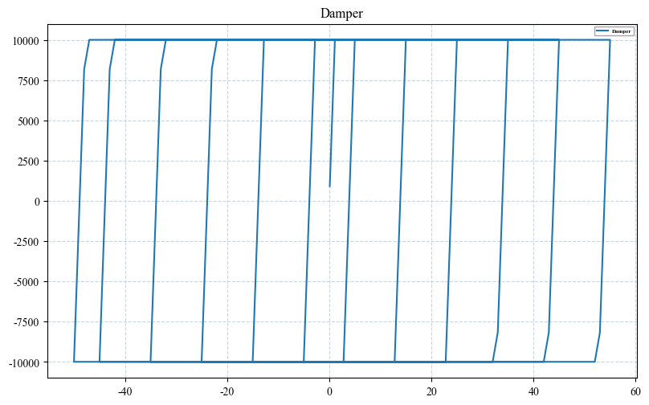

# Edited by Ashen; 微信公众号:爱研思谈; Github:AshenOneme


```python
import openseespy.opensees as ops
import opsvis as opsv
import matplotlib.pyplot as plt
import numpy as np
from matplotlib.ticker import MultipleLocator,FormatStrFormatter
from pylab import *
import os
```

## 摩擦阻尼器本构测试


```python
if not os.path.exists('ElasticPP'):
    os.makedirs('ElasticPP')

font_Times_New_Roman={"family":"Times New Roman",
                        # "style": "italic",
                        "weight":"heavy",
                        "size":5}
font_Times_New_Roman_legend={"family":"Times New Roman",
                        # "style": "italic",
                        "weight":"heavy",
                        "size":5}

font_Song={"family":"SimSun",
        "style":"italic",
        "weight":"heavy",
        "size":15}
plt.rcParams['font.sans-serif']=['Times New Roman']
plt.rc('axes', unicode_minus=False)
fig,ax=plt.subplots(nrows=1,ncols=1,figsize=(8,5),dpi=100)
# fig.subplots_adjust(left=0.15,right=0.95,top=0.95,bottom=0.15)
fig.tight_layout()
bwith = 1.5 

ops.wipe()
ops.model('basic', '-ndm', 2, '-ndf', 3)
IDDamper = 2
E=10000
epsyP=1
epsyN=1
ops.uniaxialMaterial('ElasticPP', IDDamper, E, epsyP, epsyN,0.0)
ops.node(1,0,0)
ops.node(2,100,0)
ops.equalDOF(1,2,2,3)
ops.fix(1,1,1,1)
ops.fix(2,0,1,1)
ops.element('twoNodeLink',1,1,2,'-mat',IDDamper,'-dir',1)
ops.recorder('Node', '-file', f"./ElasticPP/ElasticPP_Disp.txt","-time",'-node', 2, '-dof',1, 'disp')
ops.recorder('Node', '-file', f"./ElasticPP/ElasticPP_Reaction.txt","-time",'-node', 1, '-dof',1, 'reaction')
ops.timeSeries('Linear', 11)
ops.pattern('Plain', 100,11)
ops.sp(2,1,1)
ops.system("BandGeneral")
ops.numberer("RCM")
ops.constraints("Penalty",1e5,1e5)
ops.test('NormDispIncr', 1e-5, 2000)
ops.algorithm("KrylovNewton")

ops.integrator("DisplacementControl",2,1,-0.1)
ops.analysis("Static")
ops.analyze(50)

ops.integrator("DisplacementControl",2,1,0.1)
ops.analysis("Static")
ops.analyze(100)

ops.integrator("DisplacementControl",2,1,-0.1)
ops.analysis("Static")
ops.analyze(200)

ops.integrator("DisplacementControl",2,1,0.1)
ops.analysis("Static")
ops.analyze(300)

ops.integrator("DisplacementControl",2,1,-0.1)
ops.analysis("Static")
ops.analyze(400)

ops.integrator("DisplacementControl",2,1,0.1)
ops.analysis("Static")
ops.analyze(500)

ops.integrator("DisplacementControl",2,1,-1)
ops.analysis("Static")
ops.analyze(60)

ops.integrator("DisplacementControl",2,1,1)
ops.analysis("Static")
ops.analyze(70)

ops.integrator("DisplacementControl",2,1,-1)
ops.analysis("Static")
ops.analyze(80)

ops.integrator("DisplacementControl",2,1,1)
ops.analysis("Static")
ops.analyze(90)

ops.integrator("DisplacementControl",2,1,-1)
ops.analysis("Static")
ops.analyze(100)

ops.integrator("DisplacementControl",2,1,1)
ops.analysis("Static")
ops.analyze(105)

ops.integrator("DisplacementControl",2,1,-1)
ops.analysis("Static")
ops.analyze(50)

ops.wipe()

Disp=np.loadtxt(f'./ElasticPP/ElasticPP_Disp.txt',usecols=1)
Force=np.loadtxt(f'./ElasticPP/ElasticPP_Reaction.txt',usecols=1)

ax.plot(-Disp,Force,label='Damper')

ax.grid(linestyle='--',color='#c9d6df')                      

ax.set_title(f'Damper')
ax.legend(prop=font_Times_New_Roman_legend,edgecolor='#928a97',facecolor='none')
plt.show()
```

    ElasticPPMaterial::ElasticPPMaterial() - eyn > 0, setting < 0
    


    

    


## 建立钢框架


```python
ops.wipe() # 初始清空
ops.model('basic', '-ndm', 3, '-ndf', 6)  # frame 3D
IDSteel = 1
Fy_Steel = 335
E0_Steel = 206000
bs_Steel = 0.005
R0 = 12.5
cR1 = 0.925
cR2 = 0.15
ops.uniaxialMaterial('Steel02', IDSteel, Fy_Steel, E0_Steel, bs_Steel,R0,cR1,cR2)

HI=150
WI=150
cx=10
cy=7

A=[-HI/2-cx,-WI/2]
B=[-HI/2,WI/2]
C=[-HI/2,-cy/2]
D=[HI/2,cy/2]
E=[HI/2,-WI/2]
F=[HI/2+cx,WI/2]

fiber_column_section=1
ops.section('Fiber', fiber_column_section, '-GJ', 1.0e6)
ops.patch('rect', IDSteel, 1, 4, A[0], A[1], B[0], B[1])
ops.patch('rect', IDSteel, 4, 1, C[0], C[1], D[0], D[1])
ops.patch('rect', IDSteel, 1, 4, E[0], E[1], F[0], F[1])

fib_sec_1 = [['section', 'Fiber', 1, '-GJ', 1.0e6],
             ['patch', 'rect', IDSteel, 2, 8, A[0], A[1], B[0], B[1]],
             ['patch', 'rect', IDSteel, 10, 2, C[0], C[1], D[0], D[1]],
             ['patch', 'rect', IDSteel, 2, 8, E[0], E[1], F[0], F[1]],
             ]

matcolor = ['r']
opsv.plot_fiber_section(fib_sec_1, matcolor=matcolor)
plt.axis('equal')
plt.show()
```


    

    


```python
ops.node(1,-3000,0,0)
ops.node(2,3000,0,0)
ops.node(3,0,3400,0)
ops.node(4,-3000,3600,0)
ops.node(5,-200,3600,0)
ops.node(6,0,3600,0)
ops.node(7,200,3600,0)
ops.node(8,3000,3600,0)

ops.node(9,0,3400+3600,0)
ops.node(10,-3000,3600+3600,0)
ops.node(11,-200,3600+3600,0)
ops.node(12,0,3600+3600,0)
ops.node(13,200,3600+3600,0)
ops.node(14,3000,3600+3600,0)

ops.mass(4,4,4,4,0,0,0)
ops.mass(8,4,4,4,0,0,0)
ops.mass(10,4,4,4,0,0,0)
ops.mass(14,4,4,4,0,0,0)

ops.fix(1,1,1,1,1,1,1)
ops.fix(2,1,1,1,1,1,1)

for i in range(3,15):
    ops.fix(i,0,0,1,1,1,0)
coordTransf = "PDelta"  # Linear, PDelta, Corotational
IDColumnTransf=1
IDColumnIntegration=1
ops.geomTransf(coordTransf,IDColumnTransf,0,0,1)
ops.beamIntegration('Trapezoidal',IDColumnIntegration,fiber_column_section,4)

IDBeamTransf=2
IDBeamIntegration=2
ops.geomTransf(coordTransf,IDBeamTransf,0,0,1)
ops.beamIntegration('Trapezoidal',IDBeamIntegration,fiber_column_section,4)

IDBraceTransf=3
IDBraceIntegration=3
ops.geomTransf(coordTransf,IDBraceTransf,0,0,1)
ops.beamIntegration('Trapezoidal',IDBraceIntegration,fiber_column_section,4)

ops.element('dispBeamColumn',1,1,4,IDColumnTransf,IDColumnIntegration)
ops.element('dispBeamColumn',2,2,8,IDColumnTransf,IDColumnIntegration)
ops.element('dispBeamColumn',3,4,10,IDColumnTransf,IDColumnIntegration)
ops.element('dispBeamColumn',4,8,14,IDColumnTransf,IDColumnIntegration)

ops.element('dispBeamColumn',5,4,5,IDBeamTransf,IDBeamIntegration)
ops.element('dispBeamColumn',6,5,6,IDBeamTransf,IDBeamIntegration)
ops.element('dispBeamColumn',7,6,7,IDBeamTransf,IDBeamIntegration)
ops.element('dispBeamColumn',8,7,8,IDBeamTransf,IDBeamIntegration)

ops.element('dispBeamColumn',9,10,11,IDBeamTransf,IDBeamIntegration)
ops.element('dispBeamColumn',10,11,12,IDBeamTransf,IDBeamIntegration)
ops.element('dispBeamColumn',11,12,13,IDBeamTransf,IDBeamIntegration)
ops.element('dispBeamColumn',12,13,14,IDBeamTransf,IDBeamIntegration)

ops.element('dispBeamColumn',13,1,3,IDBraceTransf,IDBraceIntegration)
ops.element('dispBeamColumn',14,2,3,IDBraceTransf,IDBraceIntegration)
ops.element('dispBeamColumn',15,4,9,IDBraceTransf,IDBraceIntegration)
ops.element('dispBeamColumn',16,8,9,IDBraceTransf,IDBraceIntegration)
```

## 安装摩擦阻尼器


```python
IDDamper = 2
E=10000
epsyP=1
epsyN=1
ops.uniaxialMaterial('ElasticPP', IDDamper, E, epsyP, epsyN,0.0)
ops.element('twoNodeLink',17,3,6,'-mat',IDDamper,'-dir',1,'-orient',1,0,0,0,0,1)
ops.element('twoNodeLink',18,9,12,'-mat',IDDamper,'-dir',1,'-orient',1,0,0,0,0,1)

```

    ElasticPPMaterial::ElasticPPMaterial() - eyn > 0, setting < 0
    WARNING TwoNodeLink::setUp() - element: 17
    ignoring nodes and using specified local x vector to determine orientation
    WARNING TwoNodeLink::setUp() - element: 18
    ignoring nodes and using specified local x vector to determine orientation
    


```python
fig=plt.figure(figsize=(20,20),dpi=200)
ax=fig.gca(projection='3d')
opsv.plot_model(ax=ax,node_labels=1,element_labels=1,local_axes=False)
ax.view_init(90, 270, 'z')
plt.gca().set_box_aspect((5., 5., 1.))
plt.show()
```

    C:\Users\Ashen\AppData\Local\Temp\ipykernel_7392\3154638714.py:2: MatplotlibDeprecationWarning: Calling gca() with keyword arguments was deprecated in Matplotlib 3.4. Starting two minor releases later, gca() will take no keyword arguments. The gca() function should only be used to get the current axes, or if no axes exist, create new axes with default keyword arguments. To create a new axes with non-default arguments, use plt.axes() or plt.subplot().
      ax=fig.gca(projection='3d')
    


    

    


## 地震波加载


```python
ops.recorder('Node', '-file', "Disp12.txt","-time",'-node', 12,'-dof',1, 'disp')
ops.recorder('Node', '-file', "Disp9.txt","-time",'-node', 9,'-dof',1, 'disp')
ops.recorder('Node', '-file', "Reaction.txt","-time",'-nodeRange',1,2,'-dof',1, 'reaction')
ops.recorder('Element','-file',f"AF.txt","-time",'-ele',18,'localForce')
ops.recorder('Element','-file',f"DEF.txt","-time",'-ele',18,'deformation')
ops.timeSeries('Linear', 11)
ops.pattern('Plain', 100,11)
for i in range(5,13):
    ops.eleLoad("-ele", i, '-type', '-beamUniform', -20,0,0)
ops.constraints("Penalty", 1e8, 1e8)
ops.numberer("RCM")
ops.system('UmfPack')
ops.test('NormDispIncr', 1.e-2, 2000)
ops.algorithm('NewtonLineSearch')
ops.integrator("LoadControl", 0.1)
ops.analysis("Static")
ops.analyze(10)
ops.loadConst("-time", 0.0)

ops.timeSeries('Path',22,'-dt',0.02,'-filePath','El_NS.txt','-factor',10000)
ops.pattern('UniformExcitation', 200, 1, '-accel', 22)
ops.wipeAnalysis()
ops.constraints("Penalty", 1e8, 1e8)
# ops.constraints("Transformation")
ops.numberer('RCM')
ops.system('UmfPack')
ops.test("NormDispIncr", 1.e-5, 1000)
# ops.algorithm('KrylovNewton')
# ops.algorithm('ExpressNewton',2,1.0,'-currentTangent','-factorOnce')
ops.algorithm('NewtonLineSearch')
ops.integrator('Newmark', 0.5, 0.25)
ops.analysis('Transient')
ops.analyze(2688,0.02)
```


    0


## 查看摩擦阻尼器耗能状态


```python
ops.wipe()
Disp=np.loadtxt(f'DEF.txt',usecols=1)
Force=np.loadtxt(f'AF.txt',usecols=1)
fig,ax=plt.subplots(nrows=1,ncols=1,figsize=(8,5),dpi=100)
ax.plot(-Disp,Force,label='Damper')

ax.grid(linestyle='--',color='#c9d6df')                      

ax.set_title(f'Damper')
ax.legend(prop=font_Times_New_Roman_legend,edgecolor='#928a97',facecolor='none')
plt.show()
```


    

    

